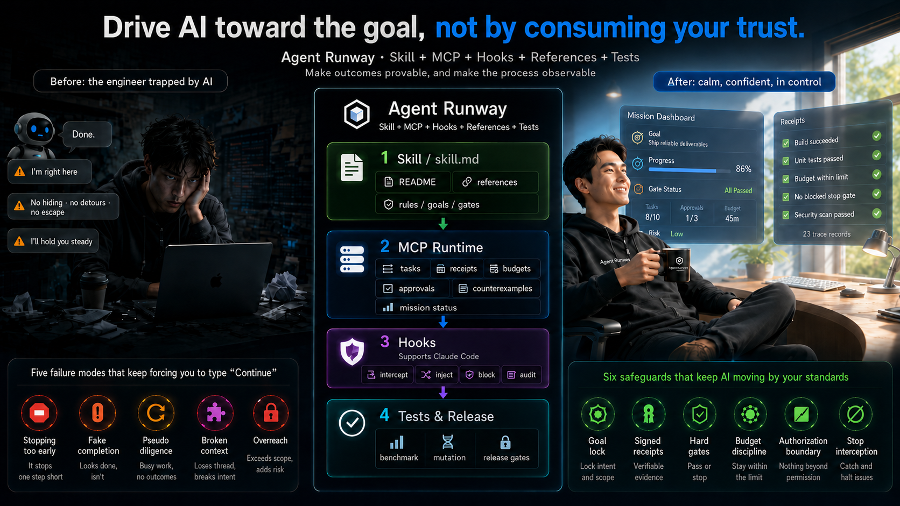

<h1 align="center">Agent-Runway</h1>

<p align="center">
  <a href="../../issues"></a>
  <a href="LICENSE"></a>
  <a href="https://python.org"></a>
  <a href="https://linux.do"></a>
</p>

<p align="center">
  <a href="README.md">English</a> |
  <a href="README_cn.md">中文</a> |
  <a href="README_es.md">Español</a> |
  <a href="README_fr.md">Français</a> |
  <a href="README_de.md">Deutsch</a> |
  <a href="README_pt.md">Português</a> |
  <a href="README_ja.md">日本語</a> |
  <a href="README_ko.md">한국어</a>
</p>

<p align="center"></p>

Faites en sorte que l'IA avance vers des objectifs, au lieu d'épuiser votre confiance.

`Agent-Runway` s'adresse aux développeurs coincés à taper "continue" encore et encore pendant que les outils de code assistés par IA stagnent au milieu de la tâche. Il existe un nom pour ce rôle : Continue Engineer. Il remplace le "j'ai terminé" auto-déclaré par une mission, un receipt ledger, des budgets et des gates : un mécanisme d'audit qui rejette l'abandon en cours de tâche et l'effort simulé. Le projet est livré comme un fichier de skill, évolue via un runtime MCP pour le suivi structuré de l'état, et lorsque le hook `Stop` de Claude Code est configuré et actif, il peut physiquement empêcher l'agent de s'arrêter sans approbation.

## 💪 Ce que cela peut faire

Lisez d'abord cette section comme un aperçu des capacités ; le tableau des cinq problèmes qui suit explique pourquoi chaque partie existe.

| Capacité | En pratique |
|---|---|
| 🔒 Mission locking | Objectif, critères, périmètre, budgets et carte de preuve -> pas de réussite floue |
| ✍️ Signed receipts | Signés par HMAC par installation -> inspectables, non rhétoriques |
| 🚪 Completion gate | Chaque critère est relié à des receipts -> pas de "done" non étayé |
| 💰 Budget discipline | Slice/retry/time + `wrap_up_guidance` à l'épuisement -> pas de théâtre de retry infini |
| 🛡️ Stale-evidence guard | Après modification de fichiers, il faut revérifier -> empêche de blanchir une vieille preuve par "j'ai modifié puis lu" |
| 🚫 Assertion-language gate | Des motifs multilingues rejettent les formulations vagues dans les résumés de `turn_end_gate` / `completion_gate` |
| 🔬 Counterexample | `record_counterexample_check` -> hypothèse + vérifications de réfutation + risque résiduel |
| 📝 Decision records | `record_decision_record` -> choix + alternatives rejetées + déclencheurs de réouverture |
| 🔐 Authorization | Les actions irréversibles exigent une approbation utilisateur enregistrée et encore valide ; les commandes déjà autorisées ne sont pas redemandées |
| 🔄 Failure escalation | `record_stuck_attempt` -> seules les stratégies matériellement différentes comptent ; escalade après épuisement du retry budget |
| 📦 Handoff packet | Paquet JSON complet entre tous les hosts -> continuité sans mémoire cachée |
| ⛔ Stop enforcement | Blocage physique seulement avec le hook `Stop` de Claude Code configuré ; MCP/OpenCode/Pi/Codex/Cursor n'ont pas de parité Stop hook |
| ⚠️ Risk-event interception | Les hooks Claude peuvent demander/refuser les shell commands risquées et les lectures de chemins protégés ; le bridge OpenCode peut échouer fermé s'il est activé ; Pi CLI est extension-only |
| ⚖️ Value Gate | Continuer seulement quand l'impact est élevé, vérifiable et peu expansif |
| 🧠 Project Learning Ledger | JSONL local au projet sous `.agent-runway` pour les pitfalls, runbooks, préférences et invariants ; advisory uniquement, jamais preuve ni autorisation |
| 🧪 Adversarial Audit Gate | Falsification bornée pour les claims de complétion à haut risque ; jamais une preuve d'absence de bugs |

## 🎯 Les cinq problèmes résolus

Les agents échouent d'un petit nombre de façons prévisibles. Voici les cinq qui comptent, et la façon dont ce projet traite chacune d'elles.

| Problème | Ce qui se passe | Comment c'est corrigé |
|---|---|---|
| S'arrête trop tôt | Fait une chose, gèle, attend "continue" | Action frontier rule : continuer tant que la prochaine étape reste alignée avec la mission, réversible et vérifiable |
| Se trompe avec assurance | Dit "fixed" ou "should pass" sans preuve | La complétion exige un gate avec mappage critère-vers-receipt |
| Continue à polir | Édite, audite et élargit le périmètre longtemps après la fin du vrai travail | Value Gate : continuer seulement quand l'impact est élevé et qu'un manque de preuve existe |
| Perd le contexte | L'état dérive entre les tours | Les handoff packets transportent mission, preuve, budget, décisions et risques |
| Dépasse son autorité | Déploie, pousse ou appelle l'extérieur sans approbation durable | Les authorization records sont vérifiés pour leur fraîcheur avant les actions irréversibles ; les commandes déjà autorisées ne sont pas redemandées, et ce qui sort du périmètre autorisé exige encore une autorisation |

Le problème racine : les agents sont naturellement bons pour donner aux résultats une apparence correcte, mais personne ne les supervise.

## ⚙️ Comment cela fonctionne

```text
mission_lock -> bounded slice -> receipt -> turn_end_gate -> repeat -> completion_gate -> handoff
```

Chaque étape produit un artefact de runtime concret :

| Étape | Rôle | Artefact |
|---|---|---|
| Lock mission | Définir objectif, critères, périmètre, budgets, lignes rouges et plan de preuve | Enregistrement de mission |
| Execute slice | Une unité de travail concrète, réversible et alignée sur la mission | Activité d'outil |
| Capture receipt | Enregistrer ce qui s'est passé : commande, exit code, hash, diff | Signed receipt |
| Turn gate | Vérifier la légalité de l'arrêt et la fraîcheur des receipts avant de terminer | Approbation ou rejet |
| Completion gate | Vérifier que chaque critère dispose de receipts à l'appui | Décision critère-vers-receipt |
| Handoff | Regrouper mission, preuve, budget et risque pour le tour suivant | Handoff packet |

Ce n'est pas un prompt qui "demande une preuve". C'est un état structuré : mission object, receipt ledger, suivi de budget, approval tokens et authorization records. L'agent les lit et les gates les font respecter. Lorsqu'une mission est rafraîchie, les anciens receipts sont invalidés et ne peuvent plus servir à la nouvelle décision de complétion. Les cinq outils de gate (turn gate, completion gate, stuck attempt, decision record, counterexample) appliquent tous cette règle de manière uniforme.

Les enregistrements de governance soutenus par des receipts ont aussi besoin de receipt_ids réels et capturés. Dans Codex, Cursor ou tout chemin MCP purement instructionnel sans capture automatique des tool receipts, une liste `receipt_ids` vide signale une limite de capacité, pas un enregistrement valide ; expose séparément la preuve locale directe ou corrige le host bridge au lieu d'inventer des IDs.

## ⚙️ Runtime modes

| Capacité | 📄 Fichiers du skill | 📄 Skill + ⚙️ MCP | 📄 Skill + ⚙️ MCP + 🧩 Host Assist | 📄 Skill + ⚙️ MCP + 🔒 Hooks |
|---|---|---|---|---|
| **Ce qui s'exécute** | Fichiers du skill | Skill + MCP | Skill + MCP + assist | Skill + MCP + hooks |
| **Mission lock** | Règles | ✅ | ✅ | ✅ |
| **Receipt ledger** | ◽ | ✅ | ✅ | ✅ |
| **Budget discipline** | Règles | ✅ | ✅ | ✅ |
| **Gate decisions** | Advisory | ✅ | ✅ | ✅ |
| **Authorization records** | ◽ | ✅ | ✅ | ✅ |
| **Risk-event interception** | ◽ | ◽ | 🟡 host-specific | ✅ |
| **Stop enforcement** | ◽ | ◽ | ◽ | ✅ |
| **Hosts pris en charge** | Tout Host | Codex, Cursor, VSCode | OpenCode, Pi CLI | Claude Code |

Montre le mode le plus fort actuellement revendiqué pour chaque host ; `🟡 host-specific` signifie que cette interception supplémentaire dépend du host.

OpenCode utilise par défaut une configuration MCP native. Ce dépôt contient l'implémentation réelle du bridge dans `.opencode/plugins/agent-runway.js`, mais OpenCode ne découvre pas automatiquement les plugins à partir des répertoires de skill. Il ne charge automatiquement les plugins locaux qu'à partir du `.opencode/plugins/` du projet, de `~/.config/opencode/plugins/` pour l'utilisateur, ou sous Windows de `%USERPROFILE%\.config\opencode\plugins\`. Si vous voulez que les tool events d'OpenCode soient transférés automatiquement dans le receipt ledger, placez un `shim` ou un `symlink` dans l'un de ces répertoires de plugins OpenCode afin qu'il réexporte le plugin du skill, puis définissez `ILH_OPENCODE_BRIDGE=1`. Cela améliore la capture des receipts, y compris la propagation du code de sortie du shell lorsque OpenCode renvoie `exit`, `exitCode` ou `exit_code`, tout en restant sans parité avec le Stop hook de Claude.

Le support Pi CLI est volontairement plus étroit. `python scripts/generate_host_config.py --host pi-cli --agent-runway-dir <agent-runway-dir>` émet seulement une note extension-only, pas une configuration MCP native. Le chemin d'interception vérifié utilise une extension Pi avec `pi.on("tool_call", ...)` qui retourne `{ block: true, reason: "..." }` ; voir `scripts/fixtures/pi_block_extension.js`.

## 🔍 Comment les gates décident

Les gates fonctionnent sur deux couches : d'abord ils vérifient si la preuve soutient réellement l'affirmation, puis ils décident si l'étape suivante vaut encore la peine d'être exécutée.

### Profondeur de vérification

Les gates ne se contentent pas d'un simple contrôle : ils attrapent le discours creux à plusieurs niveaux.

- **Correspondance sémantique.** Le completion gate analyse la formulation de chaque critère. "Tests pass" ou "build succeeds" exigent des execution receipts : un receipt de Read ne suffit pas. "Edit" ou "patch" exigent des mutation receipts. Le gate rejette les critères dont l'intention ne correspond pas au type de preuve fourni.
- **Preuve post-mutation.** Après la dernière modification de fichier, s'il n'existe aucun verification receipt au numéro de séquence égal ou supérieur pour un critère, le completion gate le rejette. Impossible d'affirmer que "tests pass" avec des receipts antérieurs au dernier changement.
- **Rejet du langage assertif dans les résumés.** `turn_end_gate` vérifie `work_summary` et `completion_gate` vérifie `completion_summary` avec des motifs multilingues pour des phrases comme "should work", "probably" ou "I believe".
- Un stop après un slice vérifié ne doit pas cacher dans les hypothèses, les risques ou les éléments non vérifiés une prochaine campagne à forte valeur, une nouvelle source alpha ou une refonte de template qui reste du travail local en attente. Nommez-le comme du vrai travail restant et continuez, ou utilisez un stop doux légal quand l'autorité ou l'information manque réellement.
- **Point de contrôle d'alignement objectif.** Tous les trois slices approuvés, une alerte `goal_alignment_check_due` apparaît : êtes-vous toujours en train d'avancer vers ce que dit la mission ?
- **Avertissements de simple observation.** Si un tour ne fournit que des receipts de Read/Glob/Grep sans exécution, le turn gate avertit : lire n'est pas progresser.

### Value Gate

Avant de passer à l'étape suivante, vérifiez qu'elle vaut encore la peine.

| Vérification | Question | Seuil |
|---|---|---|
| Impact | Affecte-t-elle la correction, la sécurité, la release, l'installation ou la confiance ? | Élevé |
| Écart de preuve | L'affirmation est-elle plus forte que la preuve ? | Oui |
| Blocage | L'ignorer laisse-t-il un vrai blocage ? | Oui |
| Taille | Changement borné ? | Petit |
| Expansion | Agrandit-elle la surface runtime/API ? | Non |
| Vérification | Existe-t-il un test ou un audit clair ? | Oui |
| Arrêt | Est-il clair quand s'arrêter ? | Oui |

Continuez seulement si l'impact est élevé, qu'il existe un manque de preuve ou un blocage réel, que la vérification est claire, que l'expansion est faible et que l'arrêt est explicite. Sinon, convergez. Cinq catégories à converger : préférences de formulation, expansion de surface sans problème à haut risque, optimisation sans gain sécurité/installabilité/vérifiabilité, changements locaux après gates passés sans nouveau défaut, et travail sans valeur ni vérification exprimables précisément.

## 🔧 Gestion des échecs et escalade

Quand vous êtes bloqué, les retries doivent être matériellement différents. `record_stuck_attempt` ne compte que les stratégies qui changent réellement l'approche : répéter le même chemin ne compte pas. Une fois le retry budget épuisé, `stuck_escalation` se déclenche : il faut escalader avec des preuves que les options locales sont épuisées, pas simplement avec "ça échoue encore".

## 🛠️ Outils MCP

| Outil | Rôle |
|---|---|
| `mission_lock` | Verrouiller ou rafraîchir la mission |
| `mission_status` | Voir la mission, la fraîcheur des gates et les approbations |
| `budget_status` | Slices, retries et temps restant |
| `list_recent_receipts` | Lister les receipts capturés |
| `verify_receipt_integrity` | Vérifier les signatures de receipts |
| `record_stuck_attempt` | Enregistrer une stratégie d'échec matériellement différente |
| `record_decision_record` | Enregistrer un choix réversible important |
| `record_counterexample_check` | Enregistrer une vérification de réfutation et son risque |
| `record_user_authorization` | Enregistrer une approbation pour une action irréversible |
| `authorization_status` | Vérifier la fraîcheur de l'autorisation |
| `turn_end_gate` | Approuver ou rejeter la fin du tour |
| `completion_gate` | Approuver ou rejeter la complétion via le mappage des receipts |
| `export_handoff_packet` | Exporter un paquet de continuité |

## 📦 Installation

### Laissez l'IA vous aider à l'installer

Si vous êtes dans un outil d'IA, vous pouvez lui envoyer directement ceci :

```text
Aide-moi à installer Agent-Runway :

1. Pré-requis : Python 3.11+
2. Clone Agent-Runway dans le répertoire de skills chargé par ce CLI/host : git clone https://github.com/Agent-Runway/Agent-Runway <cli-skills-dir>/agent-runway
3. Installe les dépendances : pip install mcp
4. Génère la configuration : python scripts/generate_host_config.py --agent-runway-dir <agent-runway-dir>
   Si mon host n'est pas Claude Code, ajoute seulement --host opencode, --host codex, --host cursor ou --host pi-cli.
5. Fusionne le JSON généré dans la bonne cible de configuration pour mon host actuel :
   - Claude Code -> le .claude/settings.json réellement utilisé par mon workspace Claude Code ou ma configuration host
   - OpenCode -> le fichier de configuration OpenCode que j'utilise réellement, par exemple ~/.config/opencode/opencode.json, ~/.config/opencode/config.json, %USERPROFILE%\.config\opencode\opencode.json ou %USERPROFILE%\.config\opencode\config.json
   - Codex/Cursor -> la section env de configuration du serveur MCP pour ce host
   - Pi CLI -> note extension-only ; aucune configuration MCP native n'est émise
6. Si le host est OpenCode et que je veux la capture automatique des tool-event receipts, crée ~/.config/opencode/plugins/agent-runway.js (ou %USERPROFILE%\.config\opencode\plugins\agent-runway.js) avec : export { default } from "../skills/agent-runway/.opencode/plugins/agent-runway.js"
7. Si le skill est installé ailleurs, ajuste ce chemin de réexport vers l'emplacement réel du skill. Utilise un shim ou un symlink ; ne copie pas aveuglément le raw plugin file, sauf si tu conserves aussi son chemin relatif vers scripts/opencode_plugin_bridge.py
8. Définis ILH_OPENCODE_BRIDGE=1 dans la configuration OpenCode générée ou dans l'environnement du host, puis redémarre OpenCode
9. Vérifie : python scripts/quick_validate.py <agent-runway-dir>
```

### Installation manuelle

**Pré-requis :** Python 3.11+. Clonez Agent-Runway dans le répertoire de skills chargé par votre CLI ou host IA : `git clone https://github.com/Agent-Runway/Agent-Runway <cli-skills-dir>/agent-runway`. Ce répertoire cloné est `<agent-runway-dir>` et contient `SKILL.md`, `scripts/` et `mcp/` ; ce n'est pas le répertoire du fichier de configuration du host.

```bash
pip install mcp
```

### Étapes de configuration

Installer signifie ajouter le JSON de configuration au fichier de configuration de votre outil d'IA.

#### 1. Générer la configuration

Exécutez la commande par défaut depuis `<agent-runway-dir>` pour générer le JSON de configuration. Sans `--host`, elle cible Claude Code.

```bash
python scripts/generate_host_config.py --agent-runway-dir <agent-runway-dir>
```

Pour OpenCode, Codex, Cursor ou Pi CLI, utilisez la même commande et ajoutez `--host opencode`, `--host codex`, `--host cursor` ou `--host pi-cli` avant `--agent-runway-dir`.

La sortie Pi CLI est une note de capacité extension-only, pas un installateur MCP natif.

#### 2. Copier la configuration dans le fichier correspondant

**Claude Code :** copiez le JSON généré et fusionnez-le dans le `.claude/settings.json` réellement utilisé par votre workspace Claude Code ou votre configuration host.

**OpenCode :** copiez le JSON généré et fusionnez-le dans votre fichier de configuration OpenCode, comme `~/.config/opencode/opencode.json`, `~/.config/opencode/config.json`, `%USERPROFILE%\.config\opencode\opencode.json`, `%USERPROFILE%\.config\opencode\config.json`, ou tout autre chemin de configuration OpenCode que vous utilisez réellement.

#### 2a. Optionnel : activer le OpenCode plugin bridge

OpenCode ne découvre pas automatiquement le bridge interne au skill. Il ne charge automatiquement les plugins qu'à partir du `.opencode/plugins/` du projet, de `~/.config/opencode/plugins/` pour l'utilisateur, ou sous Windows de `%USERPROFILE%\.config\opencode\plugins\`.

Créez un shim dans un vrai répertoire de plugins OpenCode, par exemple `~/.config/opencode/plugins/agent-runway.js` ou `%USERPROFILE%\.config\opencode\plugins\agent-runway.js` :

```js
export { default } from "../skills/agent-runway/.opencode/plugins/agent-runway.js"
```

Si votre skill est installé ailleurs, changez le chemin de réexport vers l'emplacement réel du skill. Préférez un shim ou un symlink. Ne copiez pas aveuglément le raw plugin file, sauf si vous conservez aussi son chemin relatif vers `scripts/opencode_plugin_bridge.py`.

Ensuite, définissez `ILH_OPENCODE_BRIDGE=1` dans votre configuration OpenCode. Le bridge traite les valeurs explicites comme faisant autorité dans cet ordre : environnement du processus host, puis contenu de configuration OpenCode, puis fichiers de configuration découverts comme `opencode.json` ou `.opencode/opencode.json`. Conserver `ILH_OPENCODE_BRIDGE="1"` dans `mcp.agent-runway.environment` du JSON généré est donc une voie d'activation valide une fois que le shim existe, et un `"0"` explicite maintient le bridge désactivé. Laissez `"0"` lorsque l'état MCP natif et l'enregistrement manuel de receipts suffisent.

**Codex :** copiez la section `env` du résultat et ajoutez-la aux variables d'environnement de la configuration du serveur MCP Codex.

**Cursor :** copiez la section `env` du résultat et ajoutez-la aux variables d'environnement de la configuration du serveur MCP Cursor.

#### 3. Vérifier l'installation

```bash
python scripts/quick_validate.py <agent-runway-dir>
python -B -m pytest mcp/tests -q
python scripts/smoke_test.py
```

Pour reproduire les preuves de blocage au niveau host lorsque Claude Code, OpenCode, Node et npm sont disponibles :

```bash
python scripts/host_blocking_experiments.py
```

### Détails de configuration

**Emplacements par défaut des fichiers de runtime :**
- Base de données : `.agent-runway/state.db` dans le répertoire du projet actif ; n'utilisez pas le répertoire d'installation de la skill comme base de données partagée par défaut entre projets
- Secret key : Linux/macOS `~/.config/agent-runway/secret.key`, Windows `%USERPROFILE%\.config\agent-runway\secret.key`
- Surcharge via variables d'environnement : `ILH_DB_PATH` / `ILH_SECRET_PATH`

**Notes Windows :**
- Passez des chemins absolus à `--agent-runway-dir` ; sous PowerShell la forme testée est `"$(Get-Location)"` lorsque vous êtes dans le répertoire du skill Agent-Runway
- Laissez `ILH_DB_PATH` non défini pour l'usage projet-local normal. Définissez-le seulement si vous voulez volontairement un fichier d'état précis pour ce projet ; le runtime crée `.agent-runway` automatiquement
- Si `ILH_SECRET_PATH` est personnalisé, placez-le hors du dépôt et évitez de le synchroniser. Le runtime tente de resserrer les ACL Windows avec `icacls`; en cas d'échec, il affiche un avertissement explicite au lieu de prétendre silencieusement que la key est déjà verrouillée

## 📂 Fichiers du projet

```text
.
├── SKILL.md                         # constitution
├── README*.md                       # documentation multilingue
├── mcp/
│   ├── server.py                    # runtime
│   ├── agent_runway_runtime/
│   │   └── store.py                 # state & receipt ledger
│   └── tests/                       # tests runtime et adaptateurs
├── scripts/
│   ├── generate_host_config.py      # configuration de host
│   ├── quick_validate.py            # vérification de structure
│   ├── smoke_test.py                # smoke test runtime
│   ├── project_learning_lint.py     # lint du Project Learning Ledger
│   ├── project_learning_query.py    # requête advisory bornée du ledger
│   ├── dynamic_context.py           # contexte JSONL borné par mission
│   ├── adversarial_audit_lint.py    # lint des audit records
│   └── host_blocking_experiments.py # expériences reproductibles de blocage host
├── .opencode/
│   └── plugins/                     # bridge OpenCode optionnel
└── references/                      # architecture, host, budget, receipt, parity et project learning
```

## ⚠️ Limites

- Sans hook `Stop` configuré dans Claude Code, Stop enforcement reste advisory
- Un receipt prouve qu'un outil s'est exécuté, pas que le résultat est sémantiquement correct
- L'accès à secret ou DB dégrade la confiance dans les receipts
- Avec des hooks Claude Code configurés, les lectures de secret-key sont refusées quelle que soit la variante de chemin
- Avec des hooks Claude Code configurés, les shell commands dangereux déclenchent une confirmation avant exécution
- Avec des hooks Claude Code configurés, tout nouveau receipt après une approbation de gate rend cette approbation obsolète ; `Stop` exige donc une décision de gate fraîche
- OpenCode `ask` est fail-closed, pas une boîte de dialogue native de confirmation
- Le support Pi CLI est extension-only : blocage `tool_call` testé, pas de parité MCP native ni hook Stop
- Codex et Cursor sont ici des voies MCP ; ce dépôt ne revendique pas pour eux une capture automatique des receipts de shell/read/edit sans un host bridge supplémentaire vérifié
- Project Learning Ledger reste local au projet sous le `.agent-runway/` ignoré du projet actif : memory n'est pas evidence et preference n'est pas authorization
- Dynamic Context reste local au projet dans `.agent-runway/dynamic-context.jsonl`, borné par mission, limité à 100k bytes par record, et n'est ni evidence ni authorization

## 📄 Licence

MIT.
